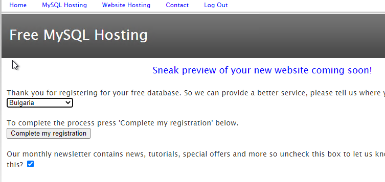
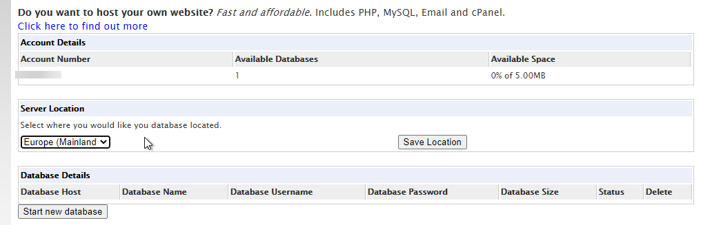
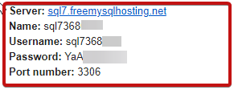
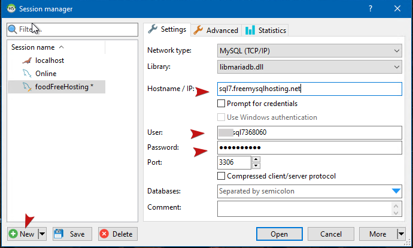

# Step by step deployment guide

### Register new gmail for admin tasks 

- All members of the team can use it
- Avoid exposing personal account password in plain text
- `AxxFinalProjectExample@gmail.com`

### Register to https://www.heroku.com/

- Main site where the app will be deployed

### Register to https://www.freemysqlhosting.net/

- Free MySQL database hosting (does not require card for activation)
- **Weekly confirmation** is needed to keep the data base live! - send on the email
- This project saves the images as blob in the database! **Use very small images** (few KBs at most) in order to fit in the 5 MB database limit while testing!

- Choose Europe(Mainland) for server location

- Start you database and the connection link, user and password will be send to the email.

- Use `https://www.heidisql.com/` to connect to the remote database

- Open and run database scripts:
    - from `database` folder
    - run `create.sql`
    - run `data.sql`
    - you may later promote the first registered user to admin - see comments in data.sql.

### Copy `app` folder for example in `D:\ExampleProjects\`

- Go to ` D:\ExampleProjects\app\src\main\resources`
   - Open `application.properties` with notepad and fill:
      - `database.url` - look at the example url
      - `database.username`
      - `database.password`

### Follow the heroku guide: https://devcenter.heroku.com/articles/deploying-spring-boot-apps-to-heroku

- Install heroku CLI and login
    - needed to work and command heroku via the console/terminal
- Skip `Creating a Spring Boot app`
    - We already have spring project
- Navigate to `project` folder:
    - cmd example: `cd /d d:\ExampleProjects\app`
- Preparing a Spring Boot app for Heroku
   - `git init`
   - `git add .`
   - `git commit -m "first commit"`
        - We initiate local git repository, then we **add** all files in the `project` folder to be tracked by git and then we commit files current state to git.
    ---
    - `heroku create `
        - Creates remote git repository and heroku application associated with it 
        - Generates unique url for the deployed app
        - Example: `https://tranquil-mountain-19785.herokuapp.com/` 
    ---
    - `git push heroku master`
        - Push our local changes to the remote heroku git repository and start building and executing the application
    ---
    - `heroku open` 
        - will open the deployed app in the browser

### Register the admin gmail as user in the application
- promote it in the data base (see above)
- remember to use small images or the database will reach its 5MB limit
- test & enjoy

### Redeploy the app if needed (change in the code):

- `git add .`
- `git commit -m "Adding new code"`
---- 
- `git push heroku master`
    - push changes to remote heroku git repository and rebild and restart of the app will follow automatically
---
 - `heroku open` - will open the deployed app in the browser